## Prometheus Observability Stack Using Docker 

### **Setup Prerequisites

To deploy the Prometheus stack using Docker Compose, we have the following prerequisites:

- AWS Account with a key pair.
- AWS CLI configured with the account.
- Terraform is installed on your local machine

**Prometheus**

Prometheus is used to scrape the data metrics, pulled from exporters like node exporters. It used to provide metrics to Grafana. It also has a TSDB(Time series database) for storing the metrics. For more info please visit the Prometheus Documentation.

**Alert Manager**

Alert manager is a component of Prometheus that helps us to configure alerts based on rules using a config file. We can notify the alerts using any medium like email, Slack, chats, etc.

With a nice dashboard where all alerts can be seen from the prometheus dashboard. For more info, please visit alert manager documentation

**Node Exporter**

Node exporter is the Prometheus agent that fetches the node metrics and makes it available for Prometheus to fetch from /metrics endpoint. So basically node exporter collects all the server-level metrics such as CPU, memory, etc.

While other custom agents are still available and can be used for pushing metrics to prometheus. For more info, please visit Node Exporter Documentation

**Grafana**

Grafana is a Data visualization tool that fetches the metrics from Prometheus and displays them as colorful and useful dashboards.

It can be integrated with almost all available tools in the market. For more info please visit Grafana Official Documentation

To deploy the Prometheus stack, we will be using the following DevOps Tools

**Terraform**

Terraform is one of the most popular Infrastructure as a Code tools created by HashiCorp. It allows developers to provide the entire infrastructure with code. 
We will use Terraform to provision the EC2 instance required for the setup.
Please fllow this link for understanding terraform structure : https://developer.hashicorp.com/terraform/tutorials/configuration-language/resource

**Docker**

Docker is a tool for packaging, deploying, and running applications in lightweight. If you want to learn about the basics of Docker, refer to the Docker basics blog.

We will deploy Prometheus components and Grafana on Docker containers

### **Project IaC Code Explained

Clone the DevOps projects repository to your workstation to follow the guide.
```
    https://github.com/fleury12/prometheus_observability.git
```
Here is the project structure and config files.

<div align="center">
    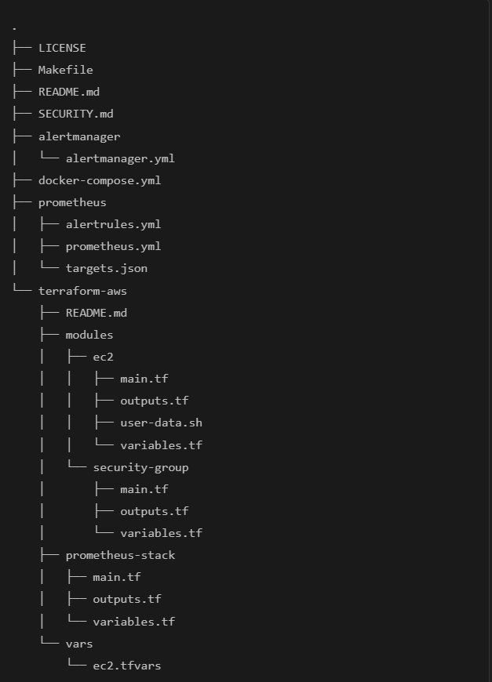
</div>

The alertmanager folder contains the alertmanager.yml file which is the configuration file. If you have details of the email, slack, etc. we can update accordingly.

The Prometheus folder contains alertrules.yml which is responsible for the alerts to be triggered from Prometheus to the alert manager.

The prometheus.yml config is also mapped to the alert manager endpoint to fetch, and Service discovery is used with the help of a file `file_sd_configs` to scrape the metrics using the targets.json file.

terraform-aws directory allows you to manage and isolate resources effectively. Modules contain the reusable Terraform code. These contain the Terraform configuration files (main.tf, outputs.tf, variables.tf) for the respective modules.

The EC2 module also includes user-data.sh script to bootstrap the EC2 instance with Docker and Docker Compose. The security group module will create all the inbound & outbound rules required.

Prometheus-stack contains the configuration file main.tf required for running Terraform. Vars contains an ec2.tfvars file which contains variable values specific to all the files for the terraform project.

The Makefile is used to update the provisioned AWS EC2's public IP address within the configuration files of prometheus.yml and targets.json located in the Prometheus directory.

The docker-compose.yml file incorporates various services Prometheus, Grafana, Node exporter & Alert Manager. These services are mapped with a network named 'monitor' and have an 'always' restart flag as well.

### **Docker Images
We are using the following latest official Docker images available from the Docker Hub Registry.

- prom/prometheus
- grafana/grafana
- prom/node-exporter
- prom/alertmanager

Now that we have learned about the tools and tech and IaC involved in the setup, lets get started with the hands-on installation.

### **Provision Server Using Terraform

Modify the values of ec2.tfvars file present in the terraform-aws/vars folder. You need to replace the values highlighted in bold with values relevant to your AWS account & region.

If you are using us-west-2, you can continue with the same AMI ID.  https://cloud-images.ubuntu.com/locator/ec2/

```
    # EC2 Instance Variables
    region         = "us-west-2"
    ami_id         = "ami-03fd0aa14bd102718"
    instance_type  = "t4g.micro"
    key_name       = "techiescamp"
    instance_count = 1
    volume-size = 20

    # VPC id
    vpc_id  = "vpc-0a5ca4a92c2e10163"
    subnet_ids     = ["subnet-058a7514ba8adbb07"]

    # Ec2 Tags
    name        = "prometheus-stack"
    owner       = "techiescamp"
    environment = "dev"
    cost_center = "techiescamp-projects"
    application = "monitoring"
```

Now we can provision the AWS EC2 & Security group using Terraform.

```
    cd terraform-aws/prometheus-stack/
    terraform fmt
    terraform init
    terraform validate
```

Execute the plan and apply the changes.

```
    terraform plan --var-file=../vars/ec2.tfvars
    terraform apply --var-file=../vars/ec2.tfvars
```

Before typing 'yes' make sure the desired resources are being created. After running Terraform, the Output should look like the following:

```
    Apply complete! Resources: 2 added, 0 changed, 0 destroyed.

    Outputs:

    instance_public_dns = [
    "ec2-34-216-95-97.us-west-2.compute.amazonaws.com",
    ]
    instance_public_ip = [
    "34.216.95.97",
    ]
    instance_state = [
    "running",
    ]
```

Now we can connect to the AWS EC2 machine just created using the public IP. Replace the key path/name and IP accordingly.

```
    ssh -i ~/.ssh/techiescamp.pem ubuntu@your-ip-address
```

We will check the cloud-init logs to see if the user data script has run successfully.

```
    tail /var/log/cloud-init-output.log
```

Below is an example output. It should show the Docker and Docker Compose versions highlighted in the image.

<div align="center">
    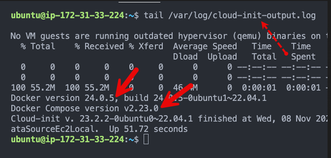
</div>

Let's verify the docker and docker-compose versions again.

```
    sudo docker version
    sudo docker-compose version
```

Now that the instance is ready with the required utilities, let's deploy the Prometheus stack using Docker Compose.

### **Deploy Prometheus Stack Using Docker Compose

Before doing this, muake sure that you mofify the alertmanager.yml (configue file).
you should configure slack or emain or both or them if you want. for gmail, create an application password in you gmail account and paste it in the `auth_password`. your `auth_username` is your gmail address 

First, clone the project code repository to the server.

```
    https://github.com/fleury12/prometheus_observability.git
    cd promethus_observability
```

Execute the following make command to update the server IP in the Prometheus config file.

We are running the node exporter on the same server to fetch the server metrics. We also update the alert manager endpoint to the server's public IP address.

```
    make all
```

You should see an output as shown below

<div align="center">
    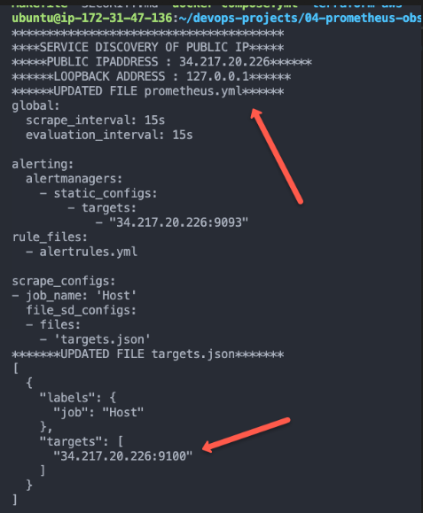
</div>

Bring up the stack using Docker Compose. It will deploy Prometheus, Alert Manager, Node exporter, and Grafana

```
    sudo docker-compose up -d
```
On a successful execution, you should see the following output :

<div align="center">
    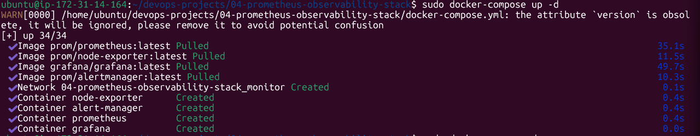
</div>

Now, with your servers IP address you can access all the apps on different ports.

- Prometheus: http://your-ip-address:9090
- Alert Manager: http://your-ip-address:9093
- Grafana: http://your-ip-address:3000

Now that the stack deployment is done, the rest of the configuration and testing will be done using the GUI.

### **Validate Prometheus Node Exporter Metrics

If you visit http://your-ip-address:9090, you will be able to access the Prometheus dashboard as shown below.

<div align="center">
    
</div>

### **Configure Grafana Dashboards

Now, let's configure Grafana dashboards for the Node Exporter metrics.

Grafana can be accessed at: http://your-ip-address:3000

Use admin as the username and password to log in to Grafana.

Now we need to add the Prometheus URL as the data source from Connections→ Add new connection→ Prometheus → Add new data source.

Here is the demo.

<div align="center">
    
</div>

### **Configure Node Exporter Dashboard

Grafana has many pre-built node exporter templates to give us a ready-to-use dashboard for the key node exporter metrics.

To import a dashboard, go to Dashboards --> Create Dashboard --> Import Dashboard --> Type 10180 and click load --> Select Prometheus Data source --> Import

Here is the demo.

<div align="center">
    
</div>

Once the dashboard template is imported, you should be able to see all the node exporter metrics as shown below.

<div align="center">
    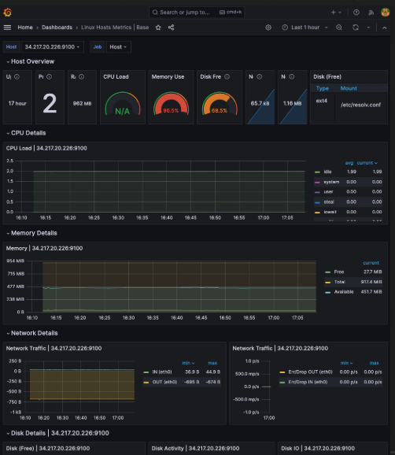
</div>

### **Simulate & Test Alert Manager Alerts

You can access the Alertmanager dashboard on http://your-ip-address:9093

<div align="center">
    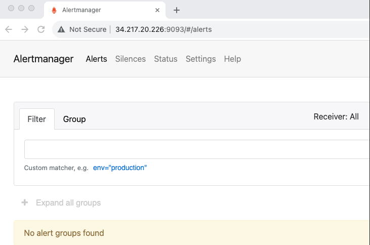
</div>

Alert rules are already backed into the Prometheus configuration through alertrules.yaml. If you go to the alerts option in the Prometheus menu, you will be able to see the configured alerts as shown below

<div align="center">
    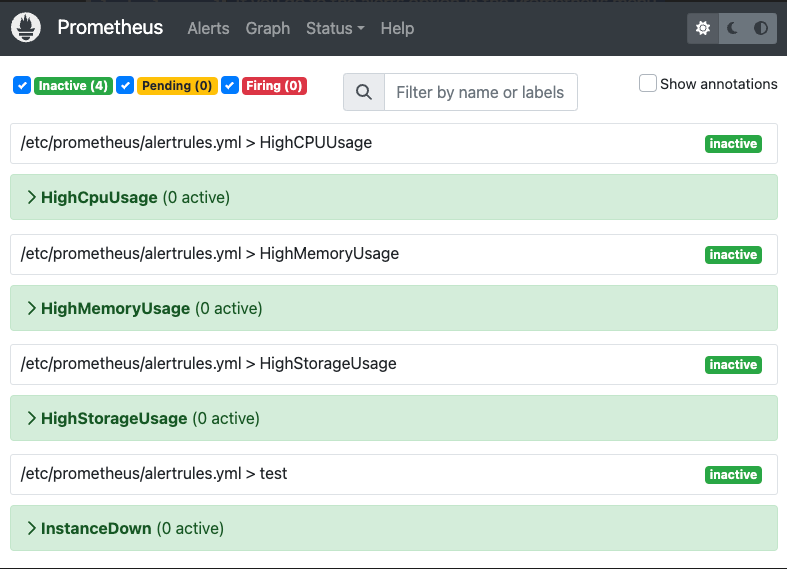
</div>

As you can see, all the alerts are in the inactive stage. To test the alerts, we need to simulate these alerts using a few Linux utilities.

You can also check the alert rules using the native promtool prometheus CLI. We need to run promtool command from inside the prometheus container as shown below.

```
    sudo docker exec -it prometheus promtool check rules /etc/prometheus/alertrules.yml
```
### **Test: High Storage & CPU Alert

```
dd if=/dev/zero of=testfile_16GB bs=1M count=16384; openssl speed -multi $(nproc --all) &
```

<div align="center">
    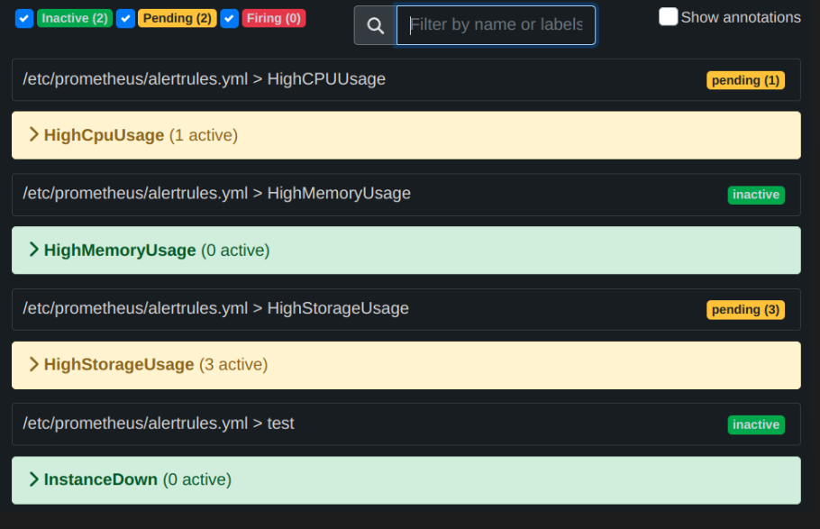
</div>

<div align="center">
    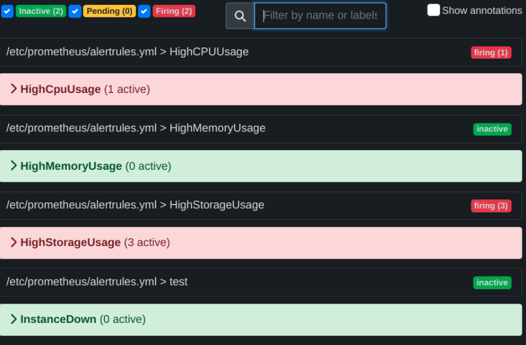
</div>

Now we can check the Alert Manager UI to confirm the alerts that were fired.

<div align="center">
    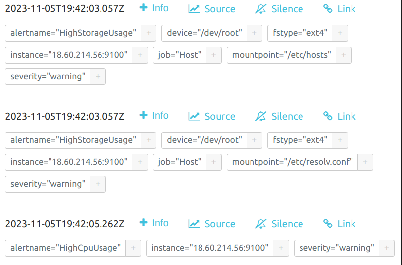
</div>

Youshoul receive this mail :

<div align="center">
    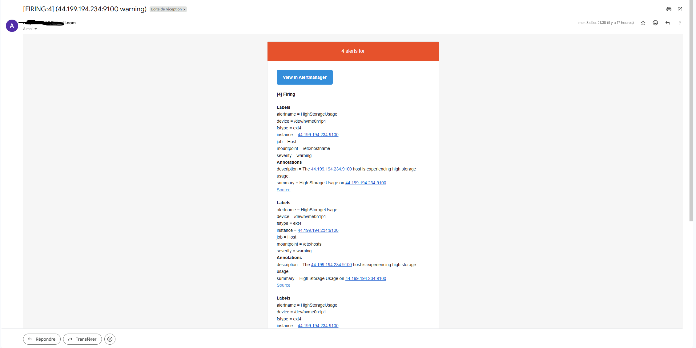
</div>

Now let's rollback the changes and see the fired alerts has been resolved.

```
    rm testfile_16GB && kill $(pgrep openssl)
```

<div align="center">
    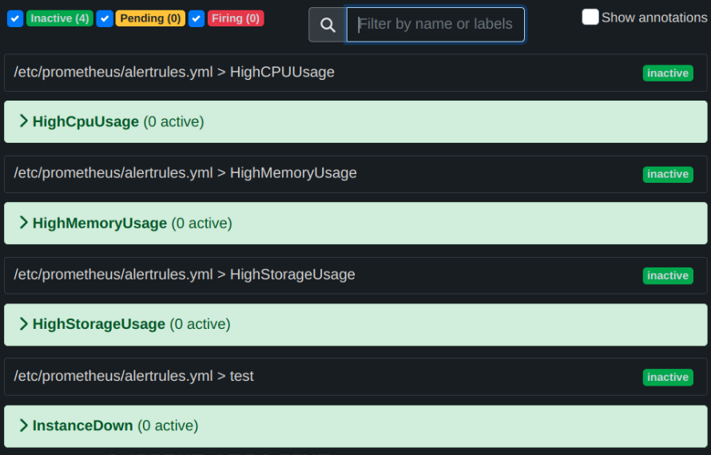
</div>

You should receive another to inform that the problem has been solved.

<div align="center">
    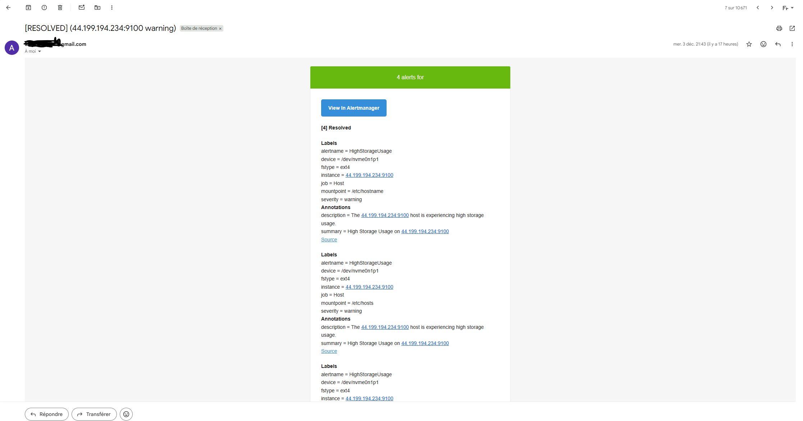
</div>

### **Cleanup The Setup

To tear down the setup, execute the following Terraform command from your workstation.

```
    terraform destroy --var-file=../vars/ec2.tfvars
```

### **Conclusion

As a quick recap we learned to provision the AWS infra using Terraform.

Then we brough up the Prometheus Observability stack using Docker compose and configured Grafana to create Node Exporter metrics dashboard.


